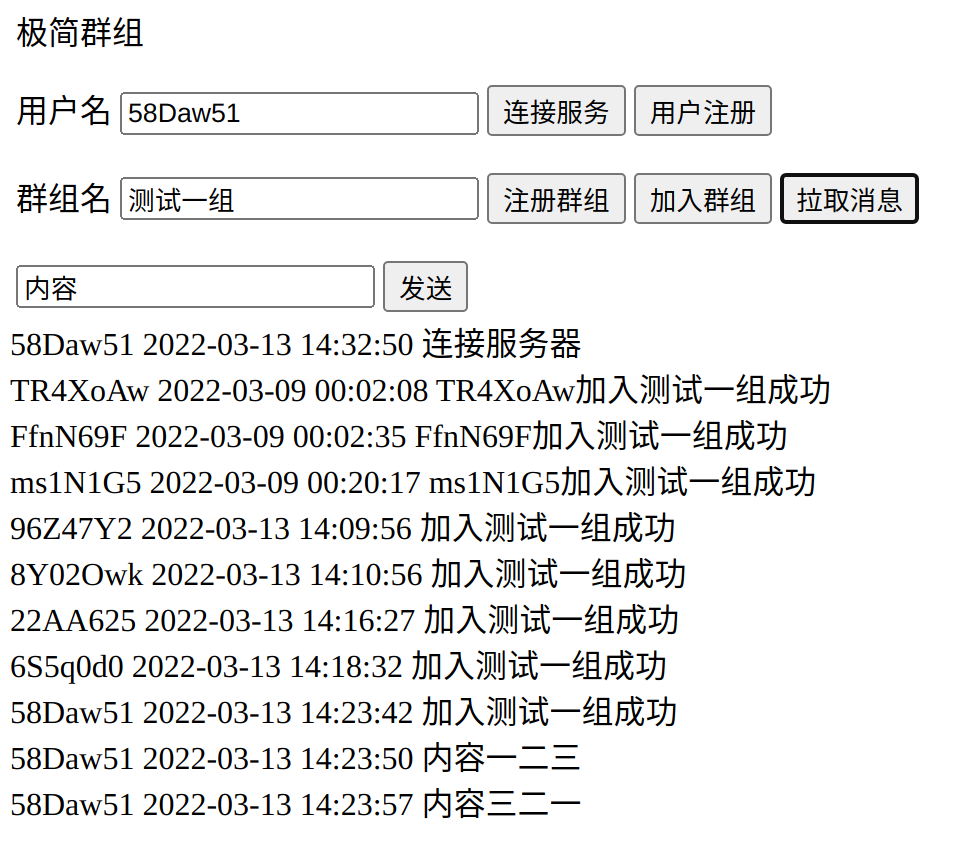
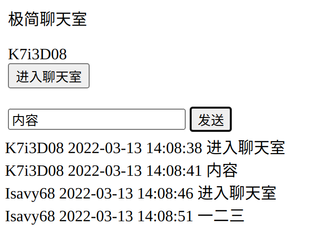

# golang聊天组

## 功能描述
当前包含两个功能：
- 临时消息的聊天室
- 持久化的聊天群组

## 运行和测试
### 运行  
`go run chatroom.go`  
### 聊天群组  
http://127.0.0.1:8081/user  
### 聊天室  
http://127.0.0.1:8081/guest  
### 单元测试(部分) 
`go test -v -run Test_Guest`  
### 效果  

 
 

## 服务简介
### Websocket框架
[Melody](https://github.com/olahol/melody)  
Minimalist websocket framework for Go

### 数据库
MySQL  
表设计见[create_table.sql](https://github.com/qew21/go-chatroom/blob/master/sql/create_table.sql)

### 消息ID
二进制长度80 Bit；每 5 个 Bit ，进行一次 32 进制编码，转换为一个字符（[0-9A-Z]去掉0\1\O\I)。  
1）第一段 42 Bit：毫秒时间戳，最长可表示到 2109 年。时间戳数据放在高位，可以保证生成的ID是按时间有序的。

2）第二段 12 Bit：自旋ID，最高4096，避免同一毫秒的重复。在第一段采用纳秒也可以做到一定程度的容错，但不如分开自旋ID高。

3）第三段 4 Bit：用于标识会话类型，最多可以标识 16 中会话类型。

4）第四段 22 Bit：会话 ID 。

### 通讯框架
主流使用GRPC，当前简易实现，以switch的形式切换不同业务

### 待完善
- 登录验证  
- 心跳保活
- 消息加密
- UI界面

 
